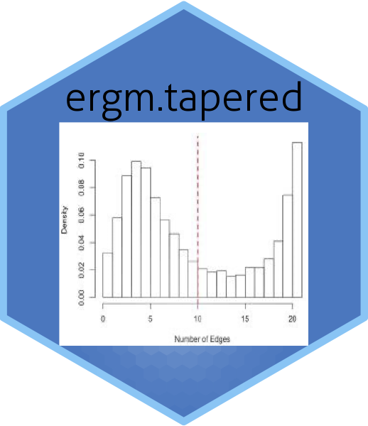

# `ergm.tapered`: Tapered Exponential-Family Models for Networks




[](https://cranlogs.r-pkg.org/)
[](https://cran.r-project.org/package=ergm.tapered)
[](https://codecov.io/github/statnet/ergm.tapered?branch=master)
[](https://github.com/statnet/ergm.tapered/actions)

A set of terms and functions implementing Tapered exponential-family random
graph models (ERGMs).  Tapered ERGMs are a modification of ERGMs that reduce the
effects of phase transitions, and with properly chosen hyper-parameters,
provably removes all multiphase behavior.

Each ERGM has a corresponding Tapered ERGM. Indeed, the `ergm.tapered` package fits any `ergm` as it is based on `ergm` itself.

# Installation

The package is available on CRAN and can be installed using

```{r}
install.packages("ergm.tapered")
```

To install the latest development version from github, the best way it to use git to create a local copy and install it as usual from there. If you just want to install it, you can also use:

```{r}
# If devtools is not installed:
# install.packages("devtools")

devtools::install_github("statnet/ergm.tapered")
```

# Implementation

Load package and example data

```{r}
library(ergm.tapered)
data(sampson)
```

Sampson (1969) recorded the social interactions among a group of monks while he was a resident as an experimenter at the cloister.
     Of particular interest are the data on positive affect relations
     ("liking," in which each monk was asked if he had positive relations
     to each of the other monks. Each monk ranked only his top three
     choices (or four, in the case of ties) on "liking".  Here, we
     consider a directed edge from monk A to monk B to exist if A
     nominated B among these top choices at any one of three time points during the year.
     For details see:
     
```
help(sampson)
```

We can make a quick visualization of the network

```{r}
plot(sampson)
```

A natural model is one that includes a term measuring the transitivity of triples in the network, defined as a set of edges {(i,j), (j,k), (i,k)}. 

```
fit <- ergm(samplike ~ edges + ttriple)
```
This fit fails to converge computationally as the model is near degenerate. We could try to get it to fit by working on the computational algorithm. However, `ergm.tapered` considers a variant of the ERGM that reflects our prior belief that the true generating process is non-degenerate:

```{r}
fit <- ergm.tapered(samplike ~ edges + ttriple)
summary(fit)
```

This tapered ERGM fits. The summary indicates that the coefficient on the transitive triple term is positive (about 0.20) and statistically above zero. 

This model fixes the tapering parameter at 2 units. 
Let's try to taper less by increasing the tapering parameter to 3 (`r=3`):
 
```
fit <- ergm.tapered(samplike ~ edges + ttriple, r=3)
summary(fit)
```
It does not effect it much.

The software allows the tapering to be estimated based on the shape of the distributions of the model statistics. Let's try that:

```
fit <- ergm.tapered(samplike ~ edges + ttriple, fixed=FALSE)
summary(fit)
```

The estimated tapering parameter is about `2.8` (It is printed under the coefficient table). This is between the default value and the second guess. The coefficients of the ERGM terms are about the same as before.


Enjoy trying `ergm.tapering`!

<!-- A more detailed vignette with information on measurement error and diagnostics can be found here: [[link to katie's page]] -->

See the following papers for more information and examples:

#### Statistical Methodology

* Fellows, Ian E. and Handcock, Mark S. (2017) [Removing Phase Transitions from Gibbs Measures](http://proceedings.mlr.press/v54/fellows17a/fellows17a.pdf), *Proceedings of the 20th International Conference on Artificial Intelligence and Statistics (AISTATS)s*, Volume 54.
* Blackburn, Bart and Handcock, Mark S. (2022) [Practical Network Modeling via Tapered Exponential-family Random Graph Models](https://doi.org/10.1080/10618600.2022.2116444), *Journal of Computational and Graphical Statistics*.

<!-- #### Applications -->

## Public and Private repositories

To facilitate open development of the package while giving the core developers an opportunity to publish on their developments before opening
them up for general use, this project comprises two repositories:
* A public repository `statnet/ergm.tapered`
* A private repository `statnet/ergm.tapered-private`

The intention is that all developments in `statnet/ergm.tapered-private` will eventually make their way into `statnet/ergm.tapered` and onto CRAN.

Developers and Contributing Users to the Statnet Project should read https://statnet.github.io/private/ for information about the relationship
between the public and the private repository and the workflows involved.

## Latest Windows and MacOS binaries

A set of binaries is built after every commit to the repository. We strongly encourage testing against them before filing a bug report, as they
may contain fixes that have not yet been sent to CRAN. They can be downloaded through the following links:

* [MacOS binary (a `.tgz` file in a `.zip`
* file)](https://nightly.link/statnet/ergm.tapered/workflows/R-CMD-check.yaml/master/macOS-rrelease-binaries.zip)
* [Windows binary (a `.zip` file in a `.zip`
* file)](https://nightly.link/statnet/ergm.tapered/workflows/R-CMD-check.yaml/master/Windows-rrelease-binaries.zip)

You will need to extract the MacOS `.tgz` or the Windows `.zip` file from the outer `.zip` file before installing. These binaries are usually
built under the latest version of R and their operating system and may not work under other versions.

You may also want to install the corresponding latest binaries for packages on which `ergm.tapered` depends, in particular
[`network`](https://github.com/statnet/network), [`statnet.common`](https://github.com/statnet/statnet.common), and
[`ergm`](https://github.com/statnet/ergm).

